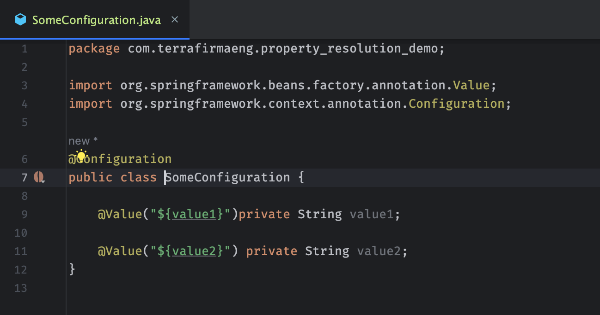
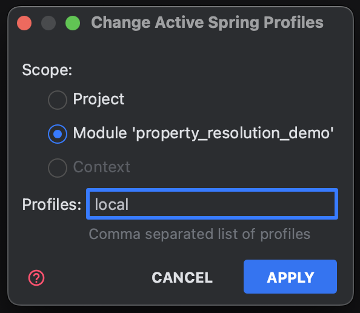
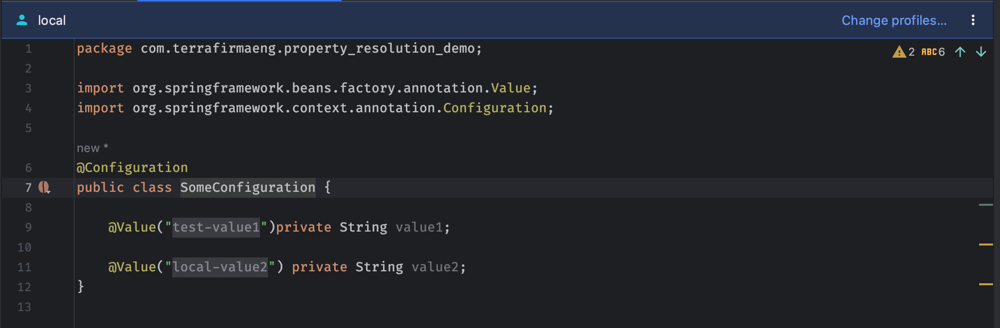
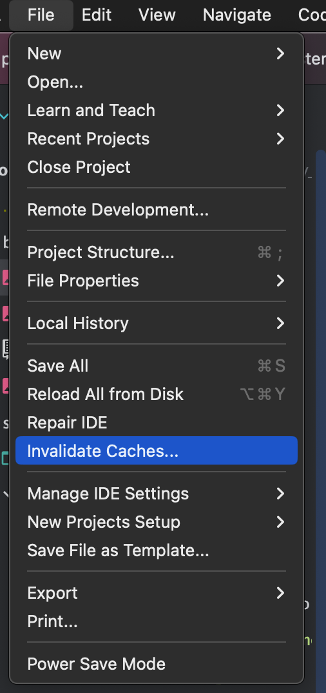
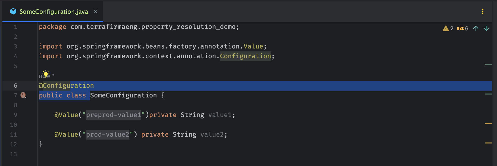
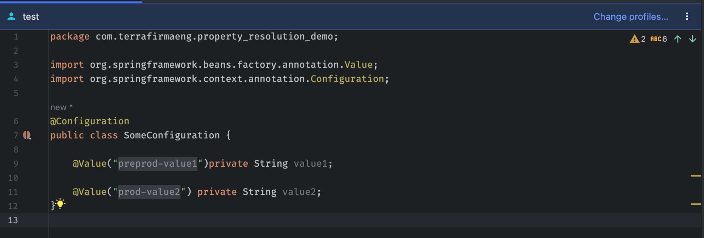

# Steps to reproduce the bug

* Open this project in intellij and open the `SomeConfiguration.java` class, you should see something similar to this



* Set your active spring profile to one of local, test, test2, preprod, prod (I'm setting this to local)



* Open `SomeConfiguration.java` and look at the values it thinks are getting injected.  What I should be seeing is 
local-value1 and local-value2, instead it's displaying value2 correctly, but showing the value of value1 as the property defined in test 



* Now I invalidate the caches



* This is what it displays when it starts back up (note that there is no current profile set).  It shows one of the values from preprod, one from prod



* Again setting the active profile, this time to test.  The view still shows the values from preprod and prod.


# IntelliJ build 
```
IntelliJ IDEA 2023.2 (Ultimate Edition)
Build #IU-232.8660.185, built on July 26, 2023
Licensed to Lane Maxwell
You have a perpetual fallback license for this version.
Subscription is active until August 10, 2025.
Runtime version: 17.0.7+7-b1000.6 x86_64
VM: OpenJDK 64-Bit Server VM by JetBrains s.r.o.
macOS 13.4.1
GC: G1 Young Generation, G1 Old Generation
Memory: 8192M
Cores: 16
Metal Rendering is ON
Registry:
editor.focus.mode.color.light=5a5d63
ide.editor.tab.selection.animation=true
debugger.new.tool.window.layout=true
ide.animate.toolwindows=true
ide.new.editor.tabs.vertical.borders=true
ide.experimental.ui=true
ide.balloon.shadow.size=0
editor.focus.mode.color.dark=5a5d63
editor.minimap.enabled=true

Non-Bundled Plugins:
org.intellij.plugins.hcl (232.8660.88)
com.jetbrains.edu (2023.7.1-2023.2-367)
io.codearte.props2yaml (1.0.2)
com.euphoricity.gitignore (0.3)
com.intellij.javaee.ejb (232.8660.142)
com.intellij.kubernetes (232.8660.158)
com.atlassian.bitbucket.references (2022.1.242)
com.intellij.bigdatatools.core (232.8660.206)
com.intellij.bigdatatools.kafka (232.8660.206)
com.intellij.bigdatatools.binary.files (232.8660.206)
com.chrisrm.idea.MaterialThemeUI (8.10.0)
com.mallowigi (92.0.0)

Kotlin: 232-1.9.0-IJ8660.185
```